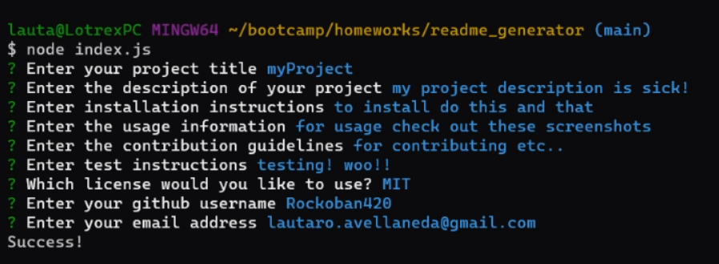

# Readme Generator      

## Table of Contents
- [Description](##Description)
- [Installation](##Installation)
- [Usage](##Usage)
- [Contributions](##Contributions)
- [License](##License)
- [Questions](##Questions)

## Description
Welcome to my readme generator! it solves the issue of always having to create specific readmes from scratch now all you do is type in your information into the console and voila! A readme is generated with all your inputs. Including a selection of different licenses with badges displayed on the top

## Installation
to install, download files run with npm init and npm i to install inquirer dependancies and then node run the index file and enjoy!

## Usage
- 

## License
  Copyright 2023 

    Permission is hereby granted, free of charge, to any person obtaining a copy of this software and associated documentation files (the “Software”), to deal in the Software without restriction, including without limitation the rights to use, copy, modify, merge, publish, distribute, sublicense, and/or sell copies of the Software, and to permit persons to whom the Software is furnished to do so, subject to the following conditions:
    
    The above copyright notice and this permission notice shall be included in all copies or substantial portions of the Software.
    
    THE SOFTWARE IS PROVIDED “AS IS”, WITHOUT WARRANTY OF ANY KIND, EXPRESS OR IMPLIED, 
    INCLUDING BUT NOT LIMITED TO THE WARRANTIES OF MERCHANTABILITY, FITNESS FOR A PARTICULAR 
    PURPOSE AND NONINFRINGEMENT. IN NO EVENT SHALL THE AUTHORS OR COPYRIGHT HOLDERS BE LIABLE 
    FOR ANY CLAIM, DAMAGES OR OTHER LIABILITY, WHETHER IN AN ACTION OF CONTRACT, TORT OR OTHERWISE, 
    ARISING FROM, OUT OF OR IN CONNECTION WITH THE SOFTWARE OR THE USE OR OTHER DEALINGS IN 
    THE SOFTWARE.

## Questions
If you would like to contact me please email me at lautaro.avellaneda@gmail.com
And my github profile is https://github.com/Rockoban420